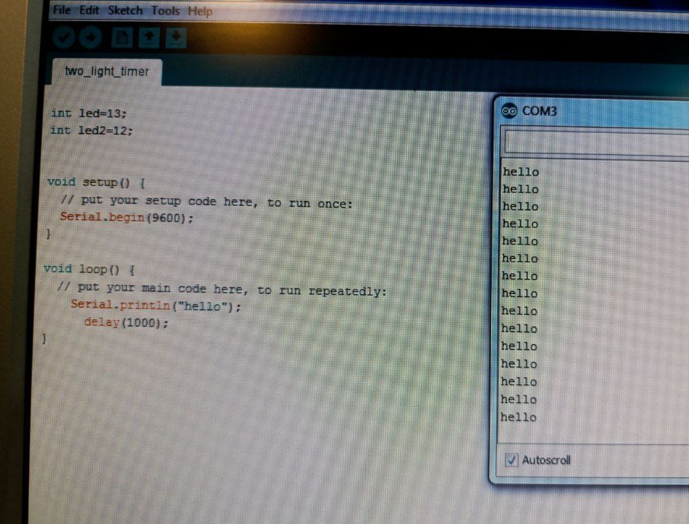

به نام خدا 
عنوان درس : آزمایشگاه ریزپردازنده 
نام استاد : جناب آقای دکتر عباسی 
نام دانشجو : آرزو ابراهیمی 
هدف آزمایش : ارسال پیام از طریق سریال
شرح آزمایش : 
برد  آردینو را به  وسیله کابل به سیستم وصل میکنیم  و نوع پورت و نوع برد آردینو را  انتخاب میکنیم.
در این ازمایش نیازی به بستن مدار در برد بورد نیست.
توضیحات کد :
اگر بخواهیم بین چند دستگاه ارتباط برقرار کنیم، از ارتباط Serial  استفاده میکنیم
در قسمت setup
Serial.begin(9600);
ک با  استفاده از عبارت begin (دستور شروع به کار سریال) و عدد درون پرانتز ک سرعت انتقال اطلاعات و همینطور شروع سریال را مشخص میکند.
قسمت set loop :
Serial.println 
ک با استفاده از این دستور  میخواهیم ارسال پیام " hello"  از طریق ارتباط سریال انجام دهیم.
و در آخر دستور delay  ک بین دستورات بالا توقف ایجاد میکنه (وقفه ۱ ثانیه ای)
سپس پنل Serial  را از قسمت 
Tools>>SerialMonitot  
(علامت ذره بین گوشه سمت راست مانیتور)
باز کرده و می بینیم ک رشته (hello) پشت سر هم چاپ میشود .
 

 


```cpp
int led = 13;
int led1= 12;

void setup ()  {
Serial.begin(9600);
}
void loop () {
Serial.println("hello");
delay(1000);
}
``` 
