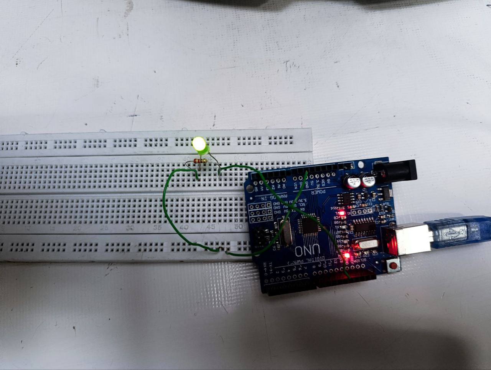

هدف ازمایش :
 روشن شدن لامپ با h,H و خاموش شدن با l,L.
ابزار و وسایل: 
بردبورد، یک عدد مقاومت ، ۳ عدد سیم‌مخابراتی ، یک عدد چراغ led
 شرح آزمایش :
 
بعد از اینکه مدار را با کابل usb  وصل کردیم . 
  چراغ را روی برد بورد قرار داده و یکی از پایه های مقاومت را در یک ستون پایه مثبت
 LED قرار داده و سپس با سیم مخابراتی در همان ستون، آنها را به پایه 13 برد آردینو وصل میکنیم.پایه دیگر مقاومت را باسیم مخابراتی به بخش زمین برد بورد برده و آنجا به GND برد آردینو وصل میکنیم



در ابتدا نوع پایه ۱۳ را مینویسیم.

```cpp
  const int led = 13;
```
و بعد در قسمت setup
حالت LED  را مشخص میکنیم و یا به عبارتی برای راه اندازی آن به دستور pinMode  نیاز داریم.
برای اینکه بتوانیم از پنل serial استفاده کنیم از دستور serial.Begin استفاده می کنیم.
ک با  استفاده از عبارت begin (دستور شروع به کار سریال) و عدد درون پرانتز ک سرعت انتقال اطلاعات و همینطور شروع سریال را مشخص میکند .
سپس در قسمت void loop

```cpp
void loop(){
if(Serial.available() > 0)  >>>چک  کردن وجود دستور در پنل 
{
 char a=Serial.read(); >>خواندن دستور پنل و ریختن در یک متغییر 
if( a =='h' || a=='H' )	>>چک کردن دستور پنل (H,h) است.
{
  digitalWrite (ledPin,HIGH);  >>دستور روشن شدن چراغ 
}
else if ( a =='l' || a=='L' )  >>چک کردن دستور پنل (L,l) است.
{
  digitalWrite (ledPin,LOW);   >>دستور خاموش کردن چراغ  
    }
   }
}
```
سپس پنل Serial  را از قسمت 
Tools>>SerialMonitot  
(علامت ذره بین گوشه سمت راست مانیتور)
باز میکنیم برای وارد کاراکترها.
با نوشتن  h یا Hچراغ روشن وبا وارد کردن Lیا l خاموش میشود.