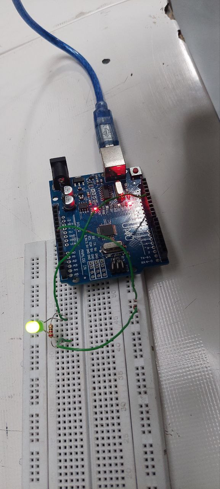

هدف آزمایش : 
روشن خاموش کردن چراغ led  با کاراکترهای on, off
ابزار و وسایل: 
بردبورد، یک عدد مقاومت ، ۳ عدد سیم‌مخابراتی ، یک عدد چراغ led
 شرح آزمایش :
 
بعد از اینکه مدار را با کابل usb  وصل کردیم . 
  چراغ را روی برد بورد قرار داده و یکی از پایه های مقاومت را در یک ستون پایه مثبت 
LED قرار داده و سپس با سیم مخابراتی در همان ستون، آنها را به پایه 13 برد آردینو وصل میکنیم.پایه دیگر مقاومت را باسیم مخابراتی به بخش زمین برد بورد برده و آنجا به GND 
بورد آردینو وصل میکنیم


ـsetup:
تعیین حالت و دستور شروع پنل سریال
ـvoid loop :
اول چک می کنیم که آیا دستوری در پنل وارد شده است یا نه
اگر وجود داشت آن را با دستور serial.readString خوانده و در یک متغیر نگه میداریم(چون دستور رشته است باید readString باشد)
سپس پنل Serial  را از قسمت 
Tools>>SerialMonitot  
(علامت ذره بین گوشه سمت راست مانیتور)
باز  میکنیم .
اگر on وارد کنیم چراغ روشن 
 و اگر رشته off را وارد کنیم خاموش شود .
 توضیحات کد :

```cpp

void setup(){
pinMode(ledPin,OUTPUT);  >>حالت پایه 
Serial.begin(9600); >>شروع کردن پنل سریال 
}
void loop() {
if(Serial.available()>0). >>دستور برای چک وجود  پنل 
 {
 String a=Serial.readString();   >>خواندن رشته  از پنل 
if( a =="on") >> چک کردن وجود on 
{
  digitalWrite (ledPin,HIGH);  >>دستور روشن شدن 
}
else if ( a=="off")  >>چک کردن. وجود off
{
  digitalWrite (ledPin,LOW);  >>دستور خاموش شدن 
    }
   }
}
```
