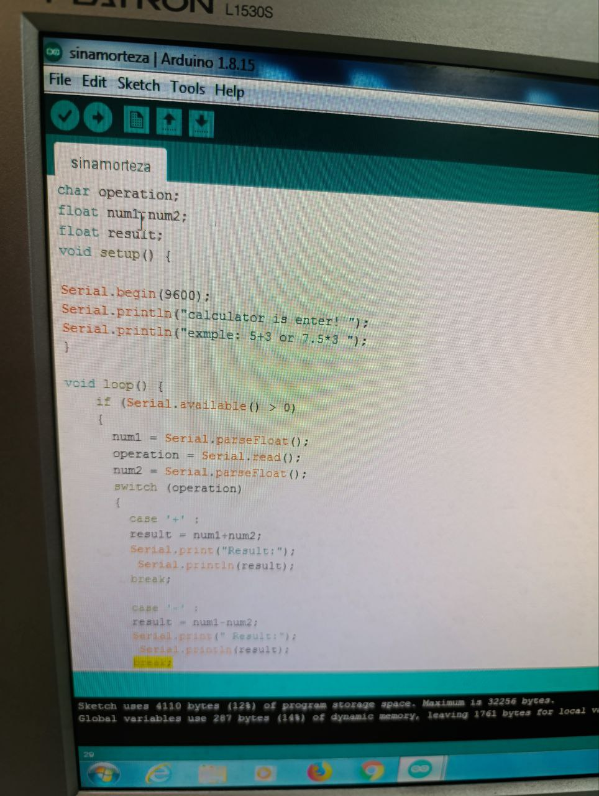
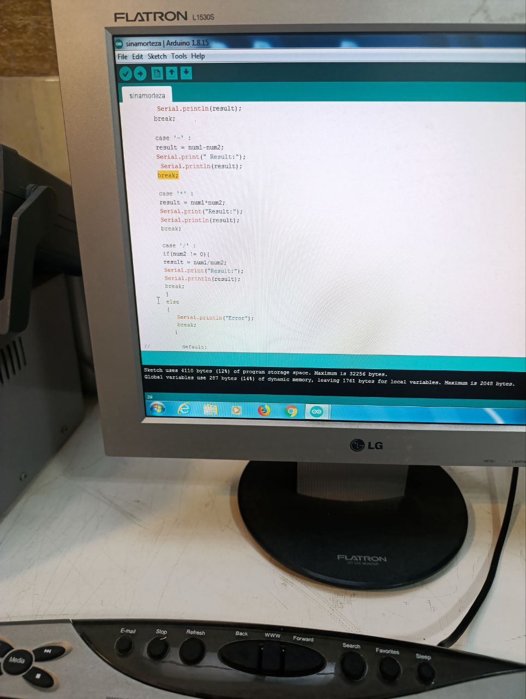
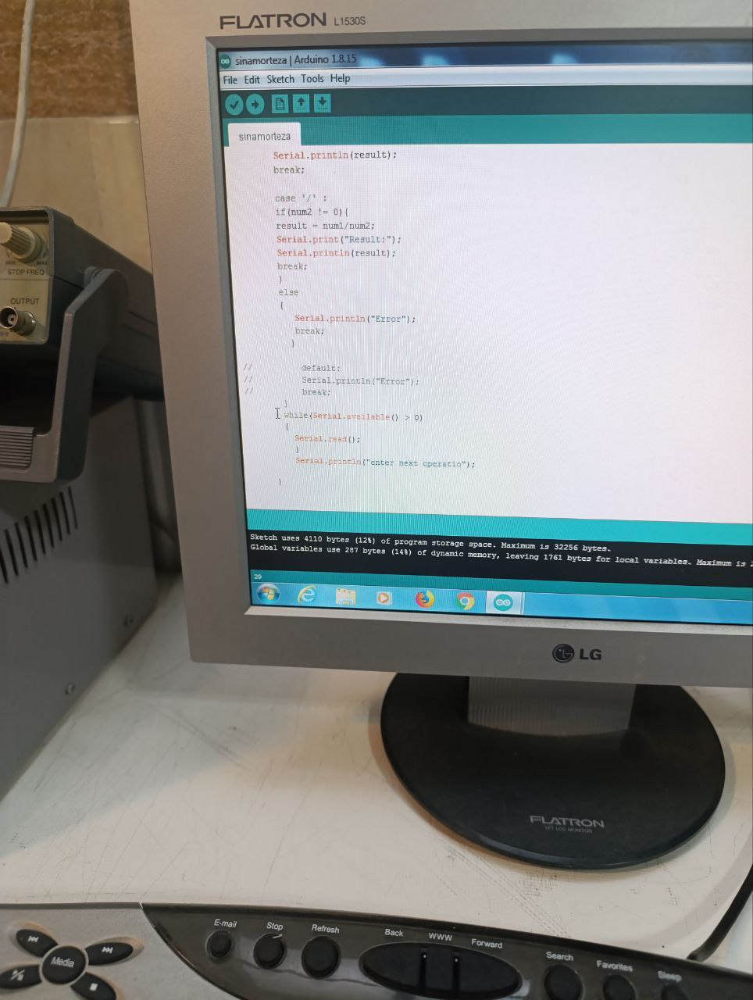

هدف آزمایش : دست کردن یک ماشین حساب در محیط آردینو 
ابزار و وسایل :  در این آزمایش ما مدار و ابزار و وسایلی نداریم.
شرح آزمایش : 
قرار است چهار عمل ریاضی اصلی (+ ،  - ,× ,÷ )  را انجام دهیم و در محیط سریال آن را وارد و خروجی را دریافت کنیم .

متغییرهای ورودیمان را نوع آن ها را مشخص و مینویسیم و سپس در قسمت 
Setup: 
Serial.begin(9600); >>  دستور  شروع به کار سریال  و عدد داخل پرانتز سرعت انتقال اطلاعات 

و در قسمت بعد سریال هایی ک به عنوان مثال میخوایم پرینت کنن را مینویسیم 

```cpp
Serial.println("caculator is  enter !")
Serial.println ..
```
 و در قسمت  set loop
 با استفاده از  حلقه های switch case  
کد مورد نظر را مینویسیم










سپس پنل Serial  را از قسمت 
Tools>>SerialMonitot  
(علامت ذره بین گوشه سمت راست مانیتور)
