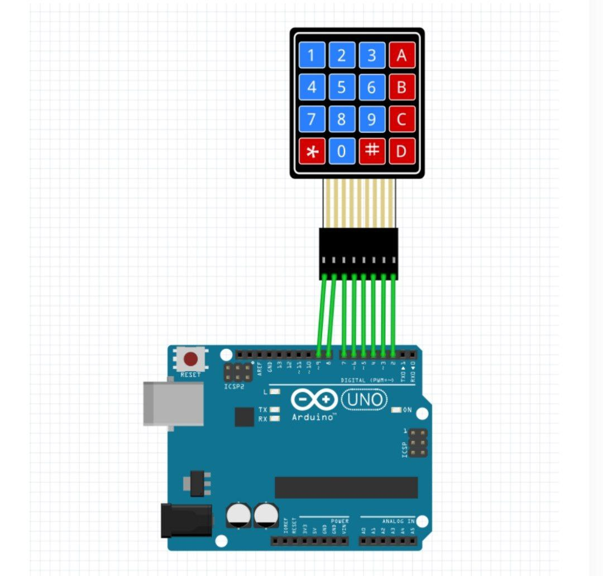

به نام  خدا 

•عنوان آزمایش: آموزش راه اندازی کی پد  با آردینو 

•ابزار و تجهیزات: برد آردینو ، کی پد ، ۶ عدد سیم مخابراتی 
•شرح آزمایش: 

ابتدا برد اردینو را به وسیله یک کابل یو اس بی به سیستم وصل میکنیم  
 مدار: 
در این ازمایش میخواهیم ک به وسیله کی پد وقتی در سریال مانیتور به آن ورودی می دهیم برای ما در سریال مانیتور به صورت خروجی نشان دهد.
از سمت راست کی پد یک سیم مخابراتی به خانه شماره ۲ و اینکار را تا خانه شماره ۹ ادامه می دهیم .
 
   
قسمت‌کد :
در این قسمت از skatch  قسمت کتابخانه را انتخاب میکنیم و گزینه keypad را انتخاب میکنیم .