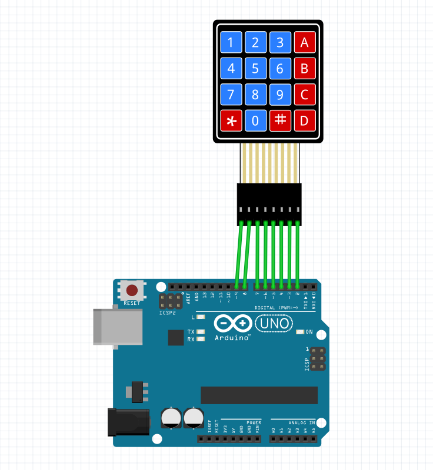

به نام  خدا 

•عنوان آزمایش:  ساخت یک ماشین حساب به وسیله کی پد در محیط اردینو 
•ابزار و تجهیزات: برد آردینو ، کی پد ، ۶ عدد سیم مخابراتی 
•شرح آزمایش: 
ابتدا برد اردینو را به وسیله یک کابل یو اس بی به سیستم وصل میکنیم  
 مدار: 
در این ازمایش میخواهیم ک به وسیله کی پد وقتی در سریال مانیتور به آن ورودی می دهیم برای ما در سریال مانیتور به صورت خروجی نشان دهد.
از سمت راست کی پد یک سیم مخابراتی به خانه شماره ۲ و اینکار را تا خانه شماره ۹ ادامه می دهیم .

  
قسمت‌کد :
در این قسمت از skatch  قسمت کتابخانه را انتخاب میکنیم و گزینه keypad را انتخاب میکنیم .

```cpp
#include <Keypad.h>
const byte ROWS = 4; 
const byte COLS = 4; 

float firstNumber = 0;
float secondNumber = 0;
float result = 0;
bool section = false;
int type = 0;


char hexaKeys[ROWS][COLS] = {
  {'1', '2', '3', 'A'},
  {'4', '5', '6', 'B'},
  {'7', '8', '9', 'C'},
  {'*', '0', '#', 'D'}
};
byte colPins[ROWS] = {5, 4, 3, 2}; 
byte rowPins[COLS] = {9, 8, 7, 6}; 

Keypad customKeypad = Keypad(makeKeymap(hexaKeys), rowPins, colPins, ROWS, COLS);

void setup() {
  Serial.begin(9600);   
}

void loop() {
  // Read the pushed button
  int button = int(customKeypad.getKey()) - 48;
  if (0 <= button && button <= 10) {
    Serial.print(button);
    if (section == false) {
      firstNumber = firstNumber * 10 + button;
    } else {
      secondNumber = secondNumber * 10 + button;
    }
  } else {
    switch (button) {
      case 17://A

        section = true;
        type = 1;
        Serial.print('+');
        break;
      case 18://///B

        section = true;
        type = 2;
        Serial.print('-');
        break;
      case 19:////C

        section = true;
        type = 3;
        Serial.print('*');
        break;
      case 20:////D

        section = true;
        type = 4;
        Serial.print('/');
        break;
      case -6:////*

        section = false;
        type = 0;
        Serial.println(' ');
        break;

      case -13://///#
        Serial.print(" = ");
        switch (type) {
          case 1:
            result = (firstNumber + secondNumber);
            break;
          case 2:
            result = (firstNumber - secondNumber);
            break;
          case 3:
            result = (firstNumber * secondNumber);
            break;
          case 4:
            result = (firstNumber / secondNumber);
            break;
        }
        type = 0;
        Serial.println(result);
        firstNumber = 0;
        secondNumber = 0;
        section = false;
        break;

    }
  }
}
```