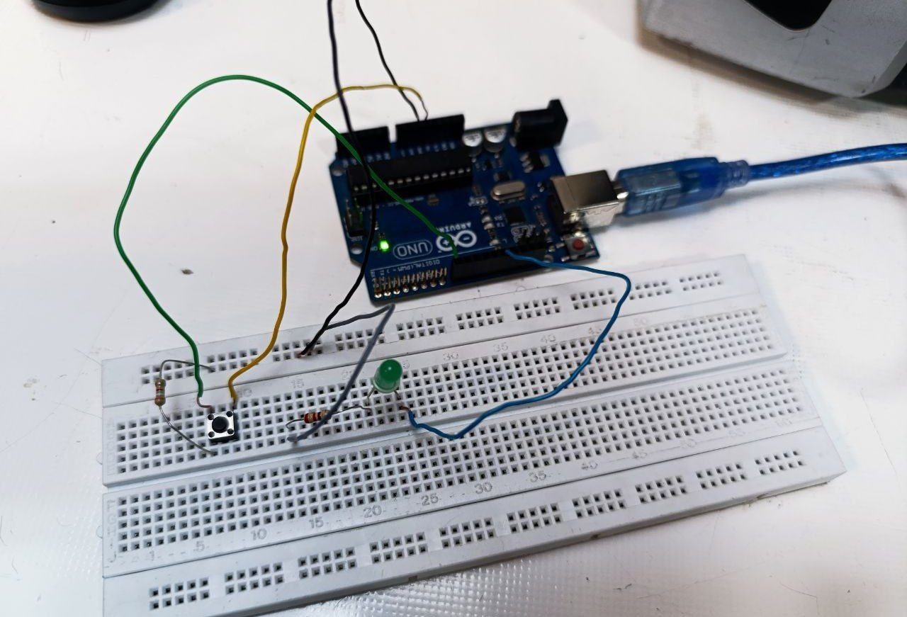
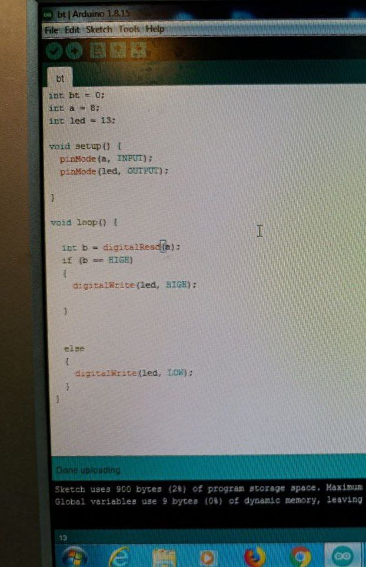

به نام خدا   
عنوان : برنامه ای بنویسید که با فشردن کلید push button ، ال ای دی پایه 13روشن و در غیر این صورت خاموش شود
ابزار و تجهیزات :ال ای دی،کلید،۴عدد ۲ عدد سیم مخابراتی،مقاومت (220)،برد آردینو ، برد بورد

بخش مدار:
پایه مثبت ال ای دی مدار را در یک ستون با سیم مخابراتی متصل به پایه ۱۳ آردینو، و پایه دیگر ال ای دی در یک ستون با پایه مقامت 220 اهم قرار میگیرد
پایه دیگر مقاومت به وسیله یک سیم مخابراتی به زمین برد بورد وصل می شود
کلید را به صورتی که سمت چپ و راست آن خالی باشد و پایه های بهم متصل آن در یک ستون باشند روی برد برد قرار میدهیم
عکس
پس با یک سیم یکی از پایه های آن را به پایه شماره 8 آردینو وصل میکنیم و پایه روبه رو متصل به شماره 8 را با یک مقاومت در همان در همان ستون به زمین برد بورد میبریم
پایه دیگ کلید را با یک سیم به 5 ولت برد آردینو وصل میکنیم

    
ابتدا پایه های 12 و 8 آردینو را تعریف میکنیم
و یک متغیر هم برای کلید تعریف میکنیم
```cpp
int bt=0; // تعریف متغیر برای کلید
int a=8;
int led = 13;
```

-setup:
در این قسمت با پینگ مود حالت دو پایه 13 و 8 را مشخص میکنیم
```cpp
void setup(){
  pinMode( a, INPUT);
  pinMode( led , OUTPUT )
}
```
-void loop:
یک متغیر مثل b در نظر میگیرم نتیجه دستور خواندن وضعیت a یا همان کلید را در آن قرار میدهیم
سپس چک میکنیم اگر b یا کلید در وضعیت روشن باشد، دستور روشن کردن لامپ را صادر میکنیم
در غیر این صورت دستور خاموش شدن لامپ
```cpp

void loop(){
  
  int b=digitalRead(a);//خواندن چگونگی a
if (b==HIGHT)//اگر فعال بود لامپ روشن
{
   digitalWrite(led,HIGHT);
}
else
{
digitaWrite( led , LOW );//لامپ خاموش
}
```
  