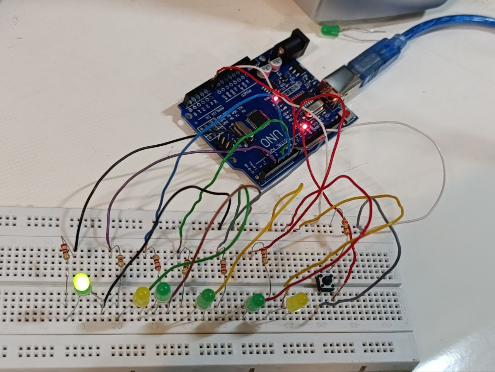

به نام خدا

عنوان : برنامه ای بنویسید که با فشردن کلید ، یک عدد تصادفی بین ۱ تا ۶ تولید و در سریال مانیتور چاپ کرده و ال ای دی مربوط به عدد را روشن کند.

هدف آزمایش: درست کردن یک تاس به وسیله کدهای رندوم در برنامه.

ابزار و وسایل : ۶ عدد ال ایی دی، بردبورد، برد آردینو ، سیم مخابراتی ، کلید ، ۶ عدد مقاومت ۲.۲ و یک عدد مقاومت ۱ کیلو

شرح آزمایش: 

"بخش مدار"
با کابل usb برد آردینو را به سیستم متصل میکنیم
۶ لامپ را در یک ردیف از برد بورد قرار میدهیم و برای هر لامپ ، مقاومتی به اندازه ۲.۲ کیلو اهم در یک ستون از پایه های مثبت قرار داده و  هر مقاومت را با سیم به پایه های شماره ۱ تا ۶ متصل میکنیم
و پایه منفی ال ای دی ها را به بخش زمین برد بورد متصل میکنیم
کلید را بین دو بخش میانی برد بورد وصل می کنیم 
یکی از پایه های کلید را به A0  برد آردینو و پایه روبه رو آن را با مقاومت ۱ کیلو اهمی به بخش اول برد بورد اتصال می دهیم و با یک سیم که به ۵ ولت برد آردینو متصل است ردیفی که مقاومت کلید متصل است را دارای ولتاژ ۵ می کنیم
و یکی از پایه های باقی مانده را به زمین متصل میکنیم

  
بخش کد
ابتدا پین کلید و ال ای دی های متصل به آردینو را تعریف میکنیم
ستاپ : با یک حلقه حالت ال ای دی ها را مشخص میکنیم
حالت کلید را تعیین میکنیم
و دستور
randomSeed(analogRead(0))
 برای جلوگیری از تکرار توالی اعداد تصادفی و تنوع بیشتر در تولید اعداد تصادفی است
لوپ : با یک حلقه همه ال ای دی ها را خاموش میکنیم و با دستور شرطی چک میکنیم اگر کلید فشرده شده باشد یک عدد تصادفی بین ۱ تا ۶ تولید و در سریال مانیتور نمایش داده و ال ای دی متصل به پین عدد ، روشن شود 
و این کار با وقفه ۱ ثانیه ای تکرار می شود
```cpp
#define key1 digitalRead(A0)//تعریف پین کلید
const int ledPins[] = {1, 2, 3, 4, 5, 6};
//پین‌های LED برای اعداد 1 تا 6

void setup() {
  Serial.begin(9600);//راه‌اندازی ارتباط سریال

  for (int i = 0; i < 6; i++) {
    pinMode(ledPins[i], OUTPUT);//راه‌اندازی ارتباط سریال
  }
  pinMode(A0, INPUT);//پین کلید به عنوان ورودی
  randomSeed(analogRead(0));//تنوع در اعداد تصادفی
}

void loop() {
  for (int i = 0; i < 6; i++) {
    digitalWrite(ledPins[i], LOW);   // خاموش کردن تمام LEDها
  }
  if (key1 == 0) {
    int randomNumber = random(0, 6);// تولید عدد تصادفی بین 1 تا6
    digitalWrite(ledPins[randomNumber], HIGH);   // روشن کردن LED مربوط به عدد تصادفی
    Serial.print("Random Number: ");
    Serial.println(randomNumber+1);// چاپ عدد تصادفی در سریال مانیتور
    delay(1000);
  }
}
```

پس از آپلود و باز کردن سریال مانیتور خواهیم دید که با فشردن کلید عدد رندوم روی سریال مانیتور نمایش داده و ال ای دی همان عدد روشن می شود.
 ●نکته:
((دستور randomSeed(analogRead(0)) در آردوینو برای تنظیم مقدار اولیه تولیدکننده اعداد تصادفی استفاده می‌شود. این دستور با خواندن مقدار از یک پایه آنالوگ (در اینجا پایه A0) که معمولاً به یک سنسور یا پین بدون اتصال متصل است، یک عدد تصادفی به عنوان «بذر» (seed) تولید می‌کند.
این عدد تصادفی باعث می‌شود توالی اعداد تولید شده توسط تابع random() در هر بار اجرای برنامه متفاوت باشد، زیرا مقدار خوانده شده از پین آنالوگ به طور طبیعی نویز الکتریکی را شامل می‌شود. این کار به جلوگیری از تکرار توالی اعداد تصادفی کمک می‌کند و تنوع بیشتری را در تولید اعداد تصادفی فراهم می‌آورد.))


نتیجه گیری: 
این پروژه آردوینو با تولید عدد تصادفی و کنترل LED‌ها، به ما امکان می‌دهد تا با مفاهیم پایه‌ای برنامه‌نویسی آشنا میکند.
این آزمایش، با استفاده از آردوینو و یک کلید، برنامه‌ای طراحی شد که با فشردن کلید، یک عدد تصادفی بین ۱ تا ۶ تولید می‌کند. این عدد در سریال مانیتور نمایش داده شده و LED مربوط به آن عدد روشن می‌شود.
نکات کلیدی